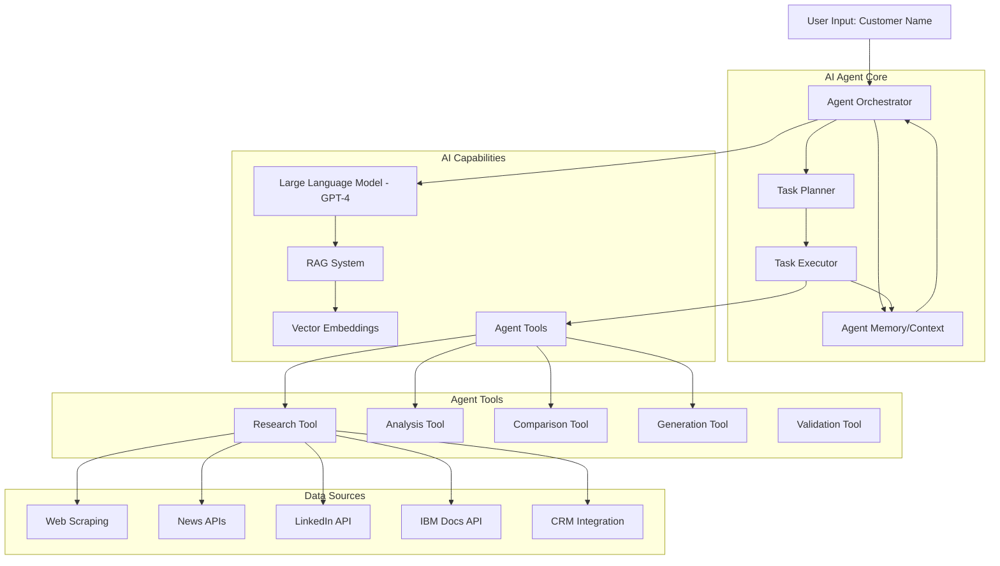

# Transforming Prospecting Dashboard into an AI Agent

## Overview

This guide outlines how to transform the current Prospecting Dashboard from a manual research tool into an intelligent AI Agent that autonomously gathers, analyzes, and synthesizes information for sales prospecting.

## Current State vs. AI Agent State

### Current State (Manual)
- User manually enters customer name and industry
- User clicks "Generate" buttons for each section
- Static product database with predefined questions
- Manual competitor selection
- Pre-formatted email templates

### AI Agent State (Autonomous)
- Agent automatically researches customer upon name entry
- Proactive information gathering across all sections
- Dynamic question generation based on context
- Autonomous competitive analysis
- Personalized email generation with reasoning

---

## Architecture for AI Agent



---

## Implementation Strategy

### Phase 1: Foundation (Weeks 1-2)

#### 1.1 Add AI Orchestrator
```typescript
// backend/src/agents/orchestrator.ts
import { OpenAI } from 'openai';

export class ProspectingAgent {
  private openai: OpenAI;
  private memory: AgentMemory;
  private tools: AgentTools;

  constructor() {
    this.openai = new OpenAI({ apiKey: process.env.OPENAI_API_KEY });
    this.memory = new AgentMemory();
    this.tools = new AgentTools();
  }

  async research(customerName: string, industry: string) {
    // 1. Plan research tasks
    const plan = await this.planResearch(customerName, industry);
    
    // 2. Execute tasks in parallel
    const results = await this.executePlan(plan);
    
    // 3. Synthesize findings
    const synthesis = await this.synthesize(results);
    
    return synthesis;
  }

  private async planResearch(customer: string, industry: string) {
    const prompt = `
      You are a sales research agent. Create a research plan for:
      Customer: ${customer}
      Industry: ${industry}
      
      Generate a structured plan with:
      1. Information to gather
      2. Sources to check
      3. Questions to answer
      4. Priority order
    `;
    
    const response = await this.openai.chat.completions.create({
      model: 'gpt-4',
      messages: [{ role: 'user', content: prompt }],
      functions: [this.getPlanningFunction()]
    });
    
    return JSON.parse(response.choices[0].message.function_call.arguments);
  }
}
```

#### 1.2 Implement Agent Memory
```typescript
// backend/src/agents/memory.ts
export class AgentMemory {
  private shortTerm: Map<string, any>;
  private longTerm: VectorStore;
  
  constructor() {
    this.shortTerm = new Map();
    this.longTerm = new PineconeStore(); // or Weaviate, Qdrant
  }

  async store(key: string, value: any, metadata?: any) {
    // Store in short-term memory
    this.shortTerm.set(key, value);
    
    // Store in long-term vector memory
    const embedding = await this.createEmbedding(value);
    await this.longTerm.upsert({
      id: key,
      values: embedding,
      metadata: { ...metadata, timestamp: Date.now() }
    });
  }

  async recall(query: string, limit: number = 5) {
    const queryEmbedding = await this.createEmbedding(query);
    return await this.longTerm.query({
      vector: queryEmbedding,
      topK: limit
    });
  }
}
```

### Phase 2: Agent Tools (Weeks 3-4)

#### 2.1 Research Tool
```typescript
// backend/src/agents/tools/research.tool.ts
export class ResearchTool {
  async execute(params: {
    customer: string;
    industry: string;
    focus: string;
  }) {
    const results = await Promise.all([
      this.searchWeb(params),
      this.searchNews(params),
      this.searchLinkedIn(params),
      this.searchCRM(params)
    ]);
    
    return this.consolidate(results);
  }

  private async searchWeb(params: any) {
    // Use Serper API, Brave Search, or similar
    const response = await fetch('https://api.serper.dev/search', {
      method: 'POST',
      headers: {
        'X-API-KEY': process.env.SERPER_API_KEY,
        'Content-Type': 'application/json'
      },
      body: JSON.stringify({
        q: `${params.customer} ${params.industry} ${params.focus}`,
        num: 10
      })
    });
    
    return response.json();
  }
}
```

#### 2.2 Analysis Tool
```typescript
// backend/src/agents/tools/analysis.tool.ts
export class AnalysisTool {
  async execute(data: any, analysisType: string) {
    const prompt = this.buildAnalysisPrompt(data, analysisType);
    
    const response = await this.openai.chat.completions.create({
      model: 'gpt-4',
      messages: [
        {
          role: 'system',
          content: 'You are an expert business analyst specializing in technology sales.'
        },
        {
          role: 'user',
          content: prompt
        }
      ],
      temperature: 0.3
    });
    
    return this.parseAnalysis(response.choices[0].message.content);
  }
}
```

#### 2.3 Competitive Intelligence Tool
```typescript
// backend/src/agents/tools/competitive.tool.ts
export class CompetitiveTool {
  async execute(params: {
    customer: string;
    ibmProducts: string[];
    competitors: string[];
  }) {
    // 1. Research competitor presence
    const competitorData = await this.researchCompetitors(params);
    
    // 2. Analyze strengths/weaknesses
    const analysis = await this.analyzeCompetition(competitorData);
    
    // 3. Generate battle cards
    const battleCards = await this.generateBattleCards(analysis);
    
    return {
      competitors: competitorData,
      analysis,
      battleCards
    };
  }

  private async generateBattleCards(analysis: any) {
    const prompt = `
      Generate detailed battle cards for IBM vs competitors.
      Analysis: ${JSON.stringify(analysis)}
      
      For each competitor, provide:
      1. IBM Strengths vs Competitor
      2. Competitor Weaknesses
      3. Key Differentiators
      4. Talking Points
      5. Discovery Questions
      6. Objection Handling
    `;
    
    // Use function calling for structured output
    return await this.llm.generateStructured(prompt, battleCardSchema);
  }
}
```

### Phase 3: Autonomous Workflows (Weeks 5-6)

#### 3.1 Auto-Research Workflow
```typescript
// backend/src/agents/workflows/auto-research.workflow.ts
export class AutoResearchWorkflow {
  async execute(customerName: string, industry: string) {
    const agent = new ProspectingAgent();
    
    // Step 1: Initial Research
    console.log('🔍 Researching customer...');
    const customerInfo = await agent.tools.research.execute({
      customer: customerName,
      industry,
      focus: 'company overview, recent news, technology stack'
    });
    
    // Step 2: Strategic Analysis
    console.log('📊 Analyzing strategic priorities...');
    const priorities = await agent.tools.analysis.execute(
      customerInfo,
      'strategic_priorities'
    );
    
    // Step 3: Product Recommendations
    console.log('💡 Identifying relevant IBM products...');
    const products = await this.recommendProducts(priorities, industry);
    
    // Step 4: Competitive Intelligence
    console.log('⚔️ Analyzing competitive landscape...');
    const competitive = await agent.tools.competitive.execute({
      customer: customerName,
      ibmProducts: products,
      competitors: await this.identifyCompetitors(customerInfo)
    });
    
    // Step 5: Contact Discovery
    console.log('👥 Finding key contacts...');
    const contacts = await agent.tools.linkedin.findContacts({
      company: customerName,
      roles: ['CIO', 'CTO', 'VP Engineering', 'CISO']
    });
    
    // Step 6: Email Generation
    console.log('✉️ Generating personalized email...');
    const email = await this.generateEmail({
      customer: customerName,
      priorities,
      products,
      competitive,
      contacts
    });
    
    return {
      customerInfo,
      priorities,
      products,
      competitive,
      contacts,
      email
    };
  }
}
```

#### 3.2 Continuous Learning
```typescript
// backend/src/agents/learning/feedback.ts
export class FeedbackLoop {
  async learn(interaction: {
    input: any;
    output: any;
    userFeedback: 'positive' | 'negative' | 'neutral';
    corrections?: any;
  }) {
    // Store interaction in memory
    await this.memory.store(`interaction_${Date.now()}`, {
      ...interaction,
      timestamp: Date.now()
    });
    
    // If negative feedback, adjust strategy
    if (interaction.userFeedback === 'negative') {
      await this.adjustStrategy(interaction);
    }
    
    // Update embeddings for better future retrieval
    await this.updateEmbeddings(interaction);
  }

  private async adjustStrategy(interaction: any) {
    // Use reinforcement learning or prompt engineering
    // to improve future responses
  }
}
```

### Phase 4: Advanced Features (Weeks 7-8)

#### 4.1 Multi-Agent System
```typescript
// backend/src/agents/multi-agent.ts
export class MultiAgentSystem {
  private agents: {
    researcher: ResearchAgent;
    analyst: AnalystAgent;
    writer: WriterAgent;
    validator: ValidatorAgent;
  };

  async collaborate(task: string) {
    // 1. Researcher gathers information
    const research = await this.agents.researcher.execute(task);
    
    // 2. Analyst processes information
    const analysis = await this.agents.analyst.execute(research);
    
    // 3. Writer creates content
    const content = await this.agents.writer.execute(analysis);
    
    // 4. Validator checks quality
    const validation = await this.agents.validator.execute(content);
    
    if (!validation.passed) {
      // Iterate until quality threshold met
      return this.collaborate(task);
    }
    
    return content;
  }
}
```

#### 4.2 Real-Time Updates
```typescript
// backend/src/agents/realtime/monitor.ts
export class RealtimeMonitor {
  async monitor(customerName: string) {
    // Set up webhooks for news alerts
    await this.setupNewsAlerts(customerName);
    
    // Monitor LinkedIn for job changes
    await this.monitorLinkedIn(customerName);
    
    // Track competitor activities
    await this.trackCompetitors(customerName);
    
    // When new information arrives, trigger agent
    this.on('new_information', async (data) => {
      const agent = new ProspectingAgent();
      const update = await agent.processUpdate(data);
      
      // Notify user
      await this.notifyUser(update);
    });
  }
}
```

---

## Frontend Integration

### Agent Status Display
```typescript
// frontend/src/components/AgentStatus.tsx
export function AgentStatus() {
  const [status, setStatus] = useState<AgentStatus>('idle');
  const [progress, setProgress] = useState<AgentProgress[]>([]);

  return (
    <div className="agent-status">
      <div className="agent-status__header">
        <div className="agent-avatar">🤖</div>
        <div className="agent-info">
          <h3>AI Research Agent</h3>
          <p className="status">{status}</p>
        </div>
      </div>
      
      <div className="agent-progress">
        {progress.map((step, i) => (
          <div key={i} className="progress-step">
            <div className="step-icon">
              {step.status === 'complete' ? '✅' : '⏳'}
            </div>
            <div className="step-info">
              <p className="step-name">{step.name}</p>
              <p className="step-detail">{step.detail}</p>
            </div>
          </div>
        ))}
      </div>
    </div>
  );
}
```

### Conversational Interface
```typescript
// frontend/src/components/AgentChat.tsx
export function AgentChat() {
  const [messages, setMessages] = useState<Message[]>([]);
  
  const sendMessage = async (text: string) => {
    // Add user message
    setMessages([...messages, { role: 'user', content: text }]);
    
    // Send to agent
    const response = await fetch('/api/agent/chat', {
      method: 'POST',
      body: JSON.stringify({ message: text, context: messages })
    });
    
    const agentResponse = await response.json();
    
    // Add agent response
    setMessages([...messages, agentResponse]);
  };

  return (
    <div className="agent-chat">
      <div className="messages">
        {messages.map((msg, i) => (
          <ChatMessage key={i} message={msg} />
        ))}
      </div>
      <ChatInput onSend={sendMessage} />
    </div>
  );
}
```

---

## Technology Stack for AI Agent

### Core AI/ML
- **LLM**: OpenAI GPT-4, Anthropic Claude, or Azure OpenAI
- **Embeddings**: OpenAI text-embedding-3-large
- **Vector Database**: Pinecone, Weaviate, or Qdrant
- **Agent Framework**: LangChain, AutoGPT, or custom

### Data Sources
- **Web Search**: Serper API, Brave Search API
- **News**: NewsAPI, Google News API
- **LinkedIn**: LinkedIn API (official)
- **Company Data**: Clearbit, ZoomInfo API
- **CRM**: Salesforce API, HubSpot API

### Infrastructure
- **Backend**: Node.js + TypeScript + Express
- **Queue**: Bull (Redis-based) for async tasks
- **Caching**: Redis for fast retrieval
- **Database**: PostgreSQL + pgvector for embeddings
- **Monitoring**: Datadog, New Relic

---

## Cost Considerations

### API Costs (Monthly Estimates)
- **OpenAI GPT-4**: $0.03/1K tokens (input), $0.06/1K tokens (output)
  - Estimated: $200-500/month for 100 customers
- **Embeddings**: $0.0001/1K tokens
  - Estimated: $20-50/month
- **Vector Database**: $70-200/month (Pinecone Starter)
- **Web Search**: $50/month (Serper API)
- **News APIs**: $50-100/month
- **LinkedIn API**: Enterprise pricing required

**Total Estimated Cost**: $400-1,000/month for 100 active customers

---

## Implementation Roadmap

### Week 1-2: Foundation
- [ ] Set up OpenAI integration
- [ ] Implement agent orchestrator
- [ ] Create agent memory system
- [ ] Build basic tool framework

### Week 3-4: Core Tools
- [ ] Research tool (web, news, LinkedIn)
- [ ] Analysis tool (strategic priorities)
- [ ] Competitive intelligence tool
- [ ] Contact discovery tool

### Week 5-6: Workflows
- [ ] Auto-research workflow
- [ ] Email generation workflow
- [ ] Continuous learning system
- [ ] Feedback loop

### Week 7-8: Advanced Features
- [ ] Multi-agent collaboration
- [ ] Real-time monitoring
- [ ] Conversational interface
- [ ] Quality validation

### Week 9-10: Polish & Deploy
- [ ] Performance optimization
- [ ] Error handling
- [ ] User testing
- [ ] Production deployment

---

## Success Metrics

### Agent Performance
- **Research Accuracy**: >90% relevant information
- **Response Time**: <2 minutes for full research
- **User Satisfaction**: >4.5/5 rating
- **Automation Rate**: >80% of tasks automated

### Business Impact
- **Time Saved**: 2-3 hours per prospect
- **Lead Quality**: 30% increase in qualified leads
- **Conversion Rate**: 20% improvement
- **User Adoption**: >70% of sales team using agent

---

## Security & Privacy

### Data Protection
- Encrypt all customer data at rest and in transit
- Implement role-based access control (RBAC)
- Audit logging for all agent actions
- GDPR/CCPA compliance for data handling

### AI Safety
- Content filtering for inappropriate outputs
- Human-in-the-loop for critical decisions
- Bias detection and mitigation
- Explainable AI for transparency

---

## Next Steps

1. **Proof of Concept**: Build minimal agent for one section (2 weeks)
2. **User Testing**: Test with 5-10 sales reps (1 week)
3. **Iterate**: Refine based on feedback (2 weeks)
4. **Scale**: Roll out to full team (4 weeks)
5. **Optimize**: Continuous improvement (ongoing)

---

## Conclusion

Transforming the Prospecting Dashboard into an AI Agent will:
- **10x productivity** by automating research
- **Improve quality** through consistent analysis
- **Scale effortlessly** to handle more prospects
- **Learn continuously** from user interactions

The investment in AI agent capabilities will pay dividends through increased sales efficiency and better customer insights.