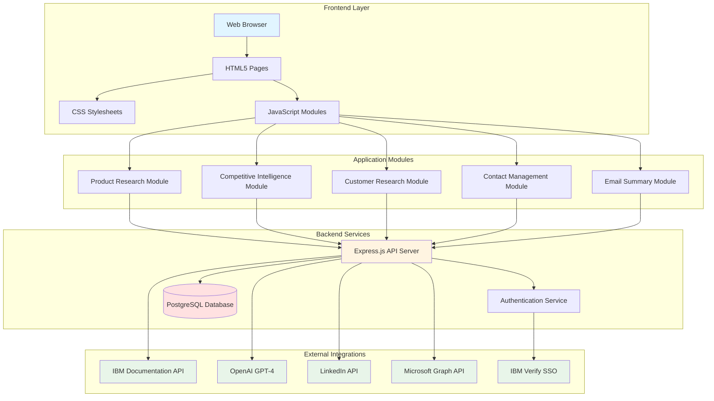
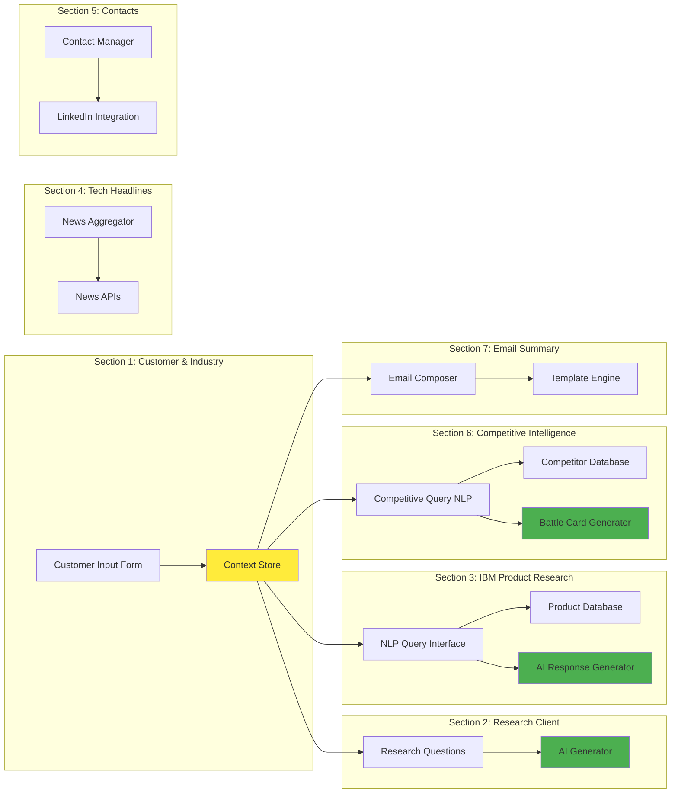
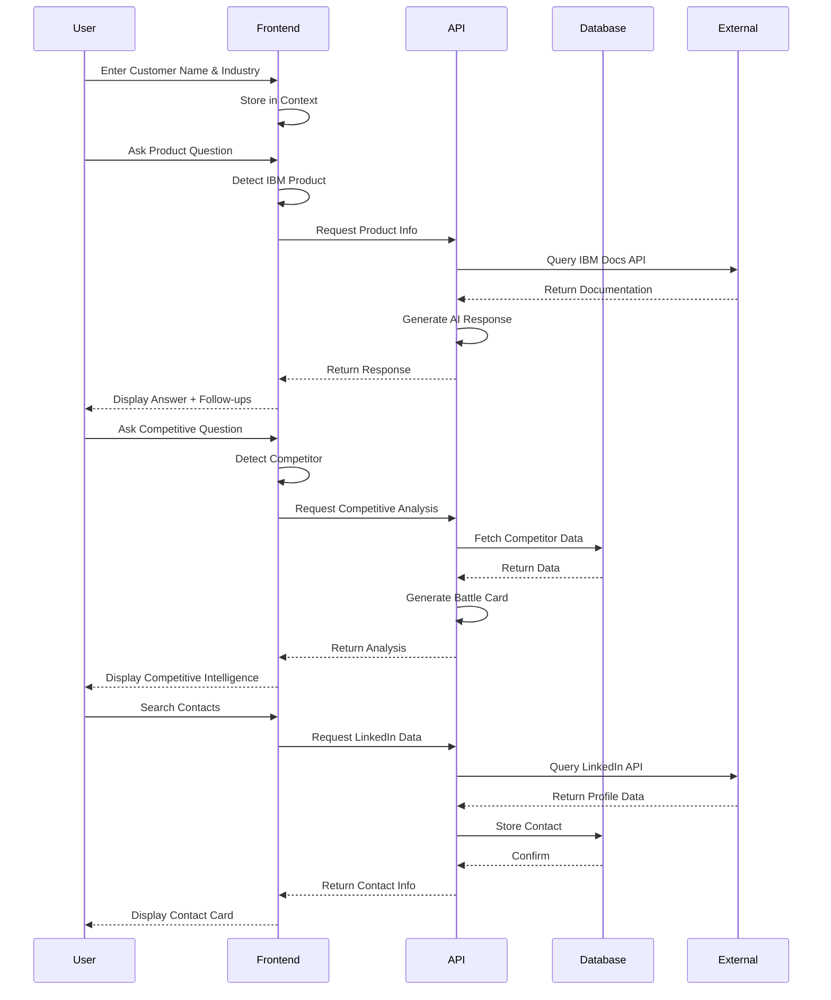
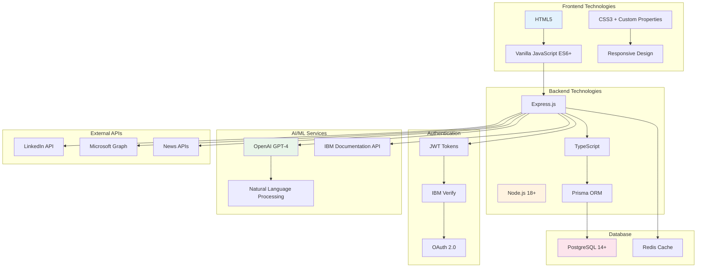
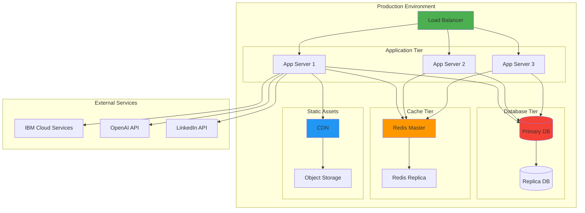
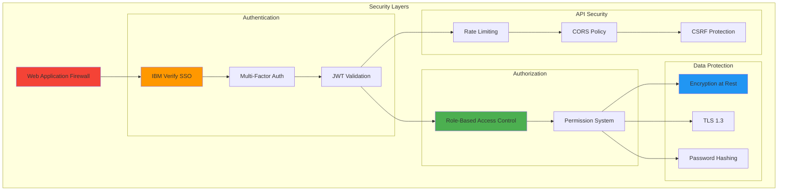
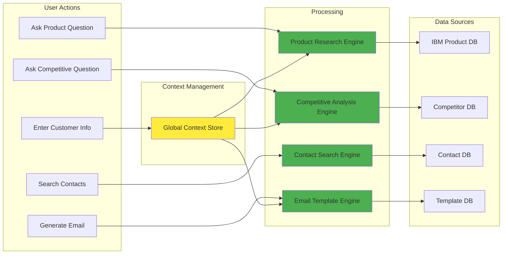

# Prospecting Board - Reference Architecture

## System Architecture Overview

## Component Architecture

## Data Flow Architecture

## Technology Stack

## Deployment Architecture

## Security Architecture

## Module Interaction Flow

---

## PowerPoint Conversion Instructions

To convert these diagrams to PowerPoint:

### Option 1: Using Mermaid Live Editor
1. Go to https://mermaid.live/
2. Copy each diagram code block
3. Paste into the editor
4. Export as PNG or SVG
5. Insert into PowerPoint

### Option 2: Using VS Code Extension
1. Install "Markdown Preview Mermaid Support" extension
2. Open this file in VS Code
3. Use "Markdown: Open Preview" command
4. Take screenshots of diagrams
5. Insert into PowerPoint

### Option 3: Manual Recreation
Use the diagram descriptions to manually create shapes and connections in PowerPoint using:
- SmartArt Graphics
- Shapes and Connectors
- Custom layouts

## Key Architecture Principles

1. **Modular Design**: Each section is an independent JavaScript module
2. **Context Preservation**: Customer data flows through all sections
3. **API-First**: Backend provides RESTful APIs for all operations
4. **Progressive Enhancement**: Works without JavaScript, enhanced with it
5. **Security by Design**: Authentication and authorization at every layer
6. **Scalable**: Horizontal scaling with load balancing
7. **Observable**: Comprehensive logging and monitoring
8. **Maintainable**: Clear separation of concerns and documentation
